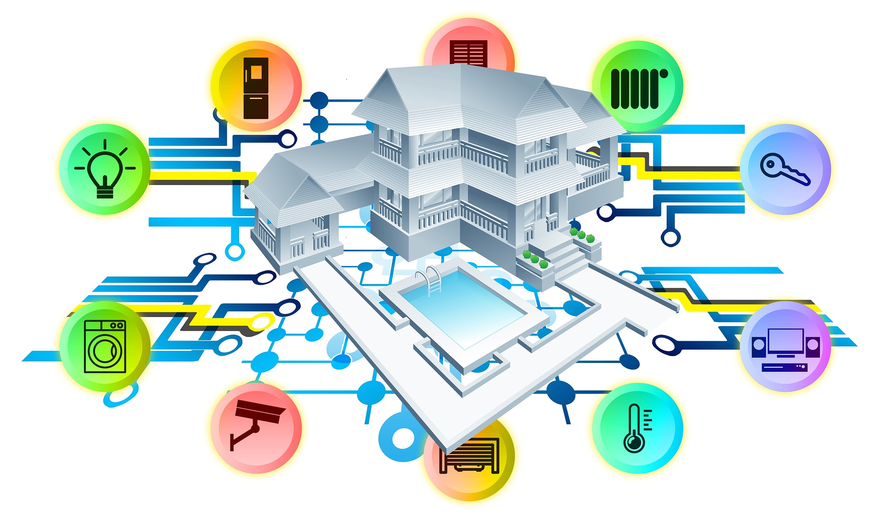
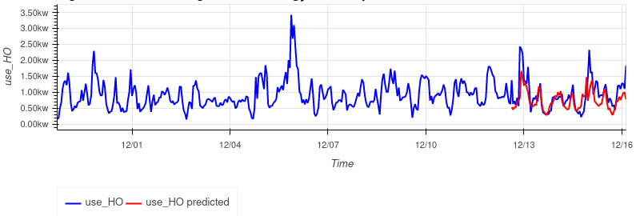
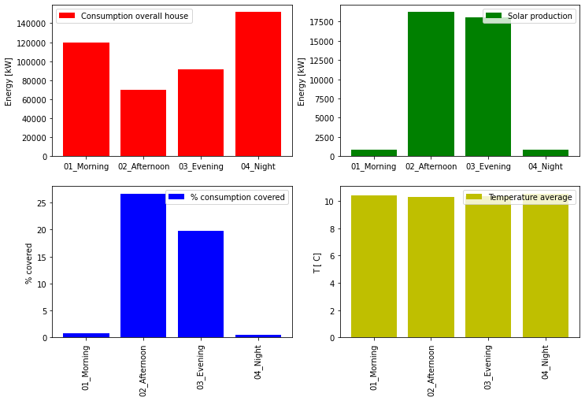

# Time series from IoT devices: anomaly detection and forecast 

## 1.Background
A young couple wants to buy a house with connected devices and solar panels. The owner has collected and shared data from IoT devices. 

Expected goals for this project: 

- Illustrate trends of energy consumption and generation
- Detect eventual appliance anomalies that may have boosted the consumption
- Predict future consumption 

## 2. The data

The smart-home dataset available on Kaggle

https://www.kaggle.com/datasets/taranvee/smart-home-dataset-with-weather-information

a 130MB csv file with several features including weather, power generated, and consumption by appliance detector.

## 3. The model outcome

Application of CUSUM method for anomaly detection showed that there were some consumption spikes, correlated to the weather but no points of steady increase. 

Models built with LightGBM can predict future energy consumption when weather information was added to the simple time information. 

## 4. Conclusions

- Consumption is high during the night, and increases significantly during hot months in the summer. This is likely due to air conditioning, house insulation may be improved.

- Almost no solar energy produced in the morning: panels orientation must be checked.

- Home appliances work well, no evident faults detected from trends anomaly.

